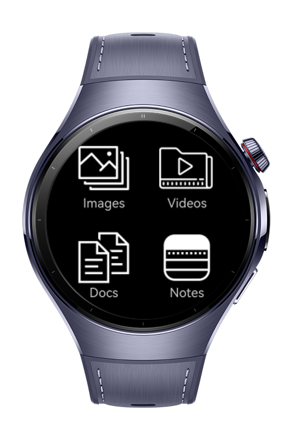
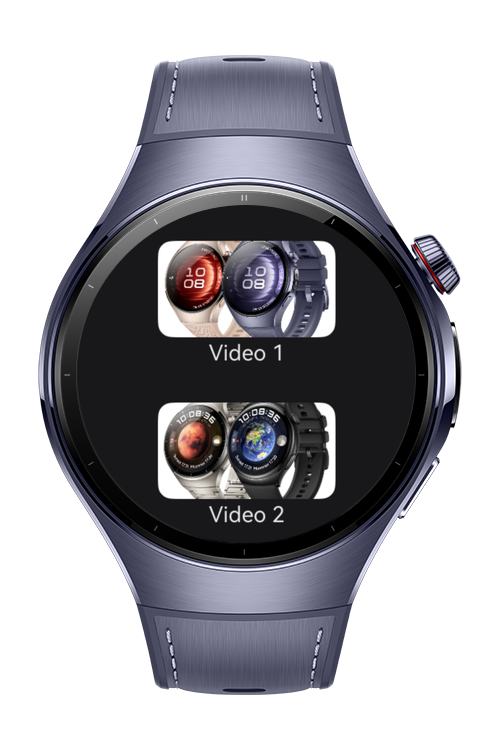
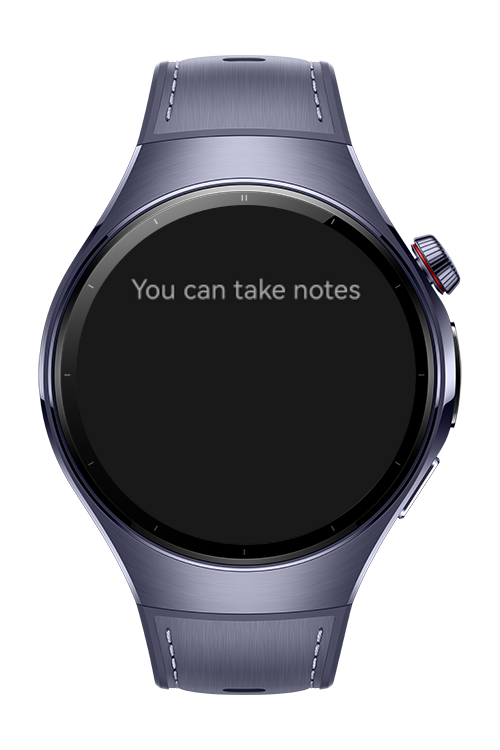

> **Note:** To access all shared projects, get information about environment setup, and view other guides, please visit [Explore-In-HMOS-Wearable Index](https://github.com/Explore-In-HMOS-Wearable/hmos-index).

# Media Player App

Media Player App is a demo project for showcasing locally stored videos and playing them upon user interaction.

# Preview

<div>







</div>

# Use Cases

Media Player App is a sample application designed to demonstrate how to access and play videos stored on the device. This app displays a list of local videos in a user-friendly interface and allows users to play them simply by tapping on the video item. It is intended to serve as a demonstration of integrating media playback functionalities into an OpenHarmony app.

1. Local Video Playback: Users can browse and play videos directly stored on their device.

2. Offline Access: Since videos are stored locally, users can watch them anytime without requiring an internet connection.

3. Quick Preview: Useful for instantly checking recorded clips, downloaded content, or personal media.

4. Organized Media Viewing: Provides a simple interface to navigate and play multiple videos in one place.

# Tech Stack

- **Languages**: ArkTS
- **Frameworks**: HarmonyOS SDK 5.0.4(16)
- **Tools**: DevEco Studio Vers 5.1.0.842
- **Libraries**: @kit.ArkUI, @kit.AbilityKit

# Directory Structure

   ```
   entry/src/main/ets/
   |---pages
   |   |---others
   |       |---Docs.ets                   // Empty file (currently has no content)
   |       |---Images.ets                 // Displays a list of images, but they are not clickable (mock data)
   |       |---Notes.ets                  // Contains a text area where users can write or edit text
   |   |---video
   |       |---VideoPlayerPage.ets        // UI design for the VideoPlayer component
   |       |---Videos.ets                 // Displays a list of videos       
   |   |---Index.ets                      // Home Page
   |---service
   |   |---VideoService.ets               // Instance file
   |---view
   |   |---TabButton.ets                  // Manages and designs the UI for the 4 tabs displayed on the screen
   |   |---VideoPlayerList.ets            // UI design for the items in the video list
   |   |---VideoPlayerPlayer.ets          // Player UI file
   |---viewmodel   
   |   |---TabViewmodel.ets               // Mock data used for managing and displaying data
   |   |---VideosViewmodel.ets            // Mock data used for managing and displaying data
   ```

# Constraints and Restrictions
## Suported Devices
- Huawei Watch 5

# License
**MediaPlayerApp** is distributed under the terms of the MIT License
See the [LICENSE](./LICENSE) for more information.